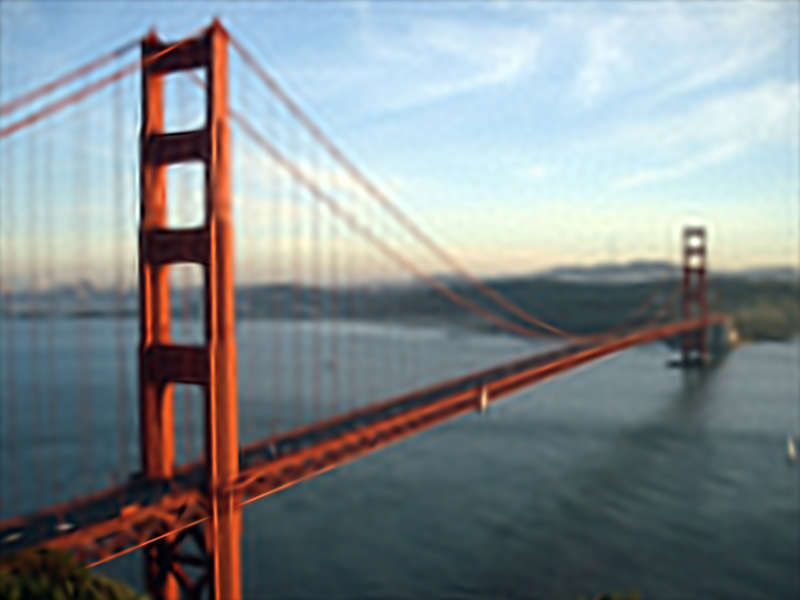

# Nanosplat-2D

This repo contains a minimal implementation of a 2D gaussian splatting solver.


## Setup

```
python -m venv .venv
source .venv/bin/activate´
pip install -r requirements.txt
```


## Run

Example usage:

```
python convert_image.py path/to/your_image.jpg

python convert_image.py examples/lena.png

python convert_image.py examples/golden_gate.jpg

python convert_image.py examples/golden_gate.jpg --config=path/to/custom/config.json

python convert_image.py examples/golden_gate.jpg --results_folder=path/to/custom/results_folder
```


## Requirements

Recommended: NVidia GPU with 6Gb VRAM, for 512x512 images.

If below the recommended VRAM, use `--config=config/low_memory.json`.

Can also use CPU but it will run significantly slower.


## Example Results

Using the default config, <10 minutes on a GTX1060 6Gb:

| Input | Result |
:-------------------------:|:-------------------------:
  |  
  |  